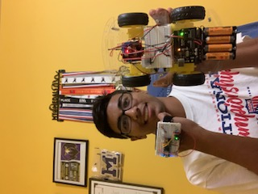
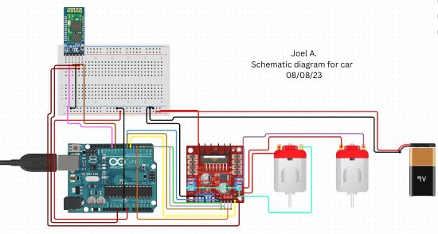
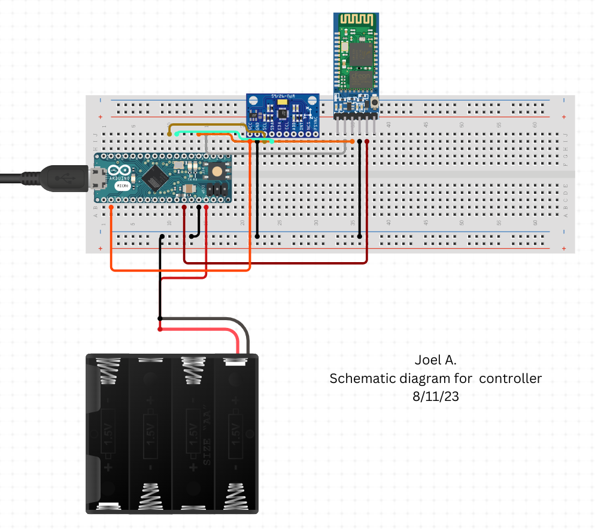

# Gesture Controlled Robotic Car
I have been working to make a gesture controlled car. After hours of concentrated effort, I was able to create a robotic car that can move according to the movement of one's hand. I loved where the two worlds of physical engineering and software met to create a versatile and unique rover. 

This project has furthered my passion in the field as I have now gained a new understanding and appreciation of circuitry, motors, and coding. My biggest challenges were understanding the concepts of energy transfer, breadboarding, and soldering, but once I mastered the skills, creating a functional product was far easier. 

| **Engineer** | **School** | **Area of Interest** | **Grade** |
|:--:|:--:|:--:|:--:|
| Joel A. | Monroe Township High School, NJ | Mechanical/Software Engineering | Incoming Junior

<p align="center">

</p>

# First Milestone

<div align="center">
<iframe width="560" height="315" src="https://www.youtube.com/embed/RnTC0cEu_lU" title="YouTube video player" frameborder="0" allow="accelerometer; autoplay; clipboard-write; encrypted-media; gyroscope; picture-in-picture; web-share" allowfullscreen></iframe>
</div>

For my first milestone, I ensured that all my parts were working and came away with a working piece of hardware:
- Materials: Chassis, motors, motor drivers, battery packs, batteries, screws, power and ground cables, Arduino, breadboard
- Without using any code, the rover is able to transfer energy from the batteries in order to move the wheels forward
- Had to reposition the motors to have the copper pads facing outward
- Consolidated wires going into my motor driver by wiring the two motors together and only having one set of wires going into the motor driver terminals
- Will upload code to the Arduino and Arduino micro. Must connect Bluetooth to the handpiece and makes sure Bluetooth and the accelerometer are accurately connected to the Arduino micro.  

# Second Milestone

<div align="center">
<iframe width="560" height="315" src="https://www.youtube.com/embed/8k7HJ021AYs" title="YouTube video player" frameborder="0" allow="accelerometer; autoplay; clipboard-write; encrypted-media; gyroscope; picture-in-picture; web-share" allowfullscreen></iframe>
</div>

For my second milestone, I was able to come away with two paired Bluetooth modules and a configured controller:
- Materials: Bluetooth module, breadboard, Arduino Micro, and Accelerometer
- I configured my transmitter controller by connecting my Arduino Micro and Bluetooth module via breadboard wiring
- The software aspect of this began with making code that would allow for transmitting and receiving signals between the Arduino Uno and Micro. I knew both Bluetooth modules were connected after the AT commands were plugged in and words could be sent and received on both serial monitors.  
- The most difficult part of the whole project was synching both of my Bluetooth modules. It took me about 3 days to recheck all of my wire configurations and I finally got it to sync after completely redoing my controller. 
- My final milestone will require a new set of code that takes the values from the accelerometer and interprets them to make the car move in the specified direction

# Code for Bluetooth connections
Here is the code I used to establish my Bluetooth connections 

```c++
//Code for Arduino Micro Bluetooth Connection
void setup() {
  Serial.begin(38400);
  Serial1.begin(38400);
}

void loop() 
{
  if (Serial1.available())
  {
    Serial.print((char)Serial1.read());
  }
  if (Serial.available())
  {
    Serial1.write(Serial.read());
  }
}
```
```c++
//Code for Arduino Uno Bluetooth Connection
#include <SoftwareSerial.h>

#define tx 3
#define rx 2

SoftwareSerial configBt(rx, tx);
long tm, t, d;

void setup() {
  //Put my setup code here, to run once:
  Serial.begin(38400);
  configBt.begin(38400); // Corrected object name to configBt
  pinMode(tx, OUTPUT);
  pinMode(rx, INPUT);
}

void loop() {
  if (configBt.available()) {
    Serial.print((char)configBt.read());
  }
  if (Serial.available()) {
    configBt.write(Serial.read());
  }
}
```

# Final Milestone

<div align="center">
<iframe width="560" height="315" src="https://www.youtube.com/embed/ukVGstyzr54" title="YouTube video player" frameborder="0" allow="accelerometer; autoplay; clipboard-write; encrypted-media; gyroscope; picture-in-picture; web-share" allowfullscreen></iframe>
</div>

For my final milestone, I was able to code and produce a fully functional product:
- Since my previous milestone I was able to use the synced Bluetooth modules in order to transmit and receive code based on the values presented by the accelerometer
- Based on the tilt of my hand, the accelerometer would produce a value that would be categorized into 5 thresholds: Forward, backward, left, right, and stop

## Code
Here is the code for my car (Arduino Uno).

```c++
//Code for the car
// This is to receive data from the other Bluetooth module and read the gestures
// The robot should move accordingly! 

#include <SoftwareSerial.h>

#define tx 2
#define rx 3

SoftwareSerial configBt(rx, tx);

//character variable for command
char c = "";

//start at 50% duty cycle
//int s = 120;

//change based on motor pins
int in1 = 5;
int in2 = 6;
int in3 = 9;
int in4 = 10;

void setup()
{
  //opens serial monitor and Bluetooth serial monitor
  Serial.begin(38400);
  configBt.begin(38400);
  pinMode(tx, OUTPUT);
  pinMode(rx, INPUT);

  //initializes all motor pins as outputs
  pinMode(in1, OUTPUT);
  pinMode(in2, OUTPUT);
  pinMode(in3, OUTPUT);
  pinMode(in4, OUTPUT);
}

void loop()
{
  //checks for Bluetooth data
  if (configBt.available()){
    //if available stores to command character
    c = (char)configBt.read();
    //prints to serial
    Serial.println(c);
  }

  //acts based on character
  switch(c){
    
    //forward case
    case 'F':
      forward();
      break;
      
    //left case
    case 'L':
      left();
      break;
      
    //right case
    case 'R':
      right();
      break;
      
    //back case
    case 'B':
      back();
      break;
      
    //default is to stop robot
    case 'S':
      freeze();
    }
}

//moves robot forward 
void forward(){
  
    //chages directions of motors
    digitalWrite(in1, LOW);
    digitalWrite(in2, HIGH);
    digitalWrite(in3, HIGH);
    digitalWrite(in4, LOW);

  }

//moves robot left
void left(){

    //changes directions of motors
    digitalWrite(in1, LOW);
    digitalWrite(in2, HIGH);
    digitalWrite(in3, LOW);
    digitalWrite(in4, HIGH);

  }

//moves robot right
void right(){

    //changes directions of motors
    digitalWrite(in1, HIGH);
    digitalWrite(in2, LOW);
    digitalWrite(in3, HIGH);
    digitalWrite(in4, LOW);

  }

//moves robot backwards
void back(){

    //changes directions of motors
    digitalWrite(in1, HIGH);
    digitalWrite(in2, LOW);
    digitalWrite(in3, LOW);
    digitalWrite(in4, HIGH);

  }

//stops robot
void freeze(){

    //changes directions of motors
    digitalWrite(in1, LOW);
    digitalWrite(in2, LOW);
    digitalWrite(in3, LOW);
    digitalWrite(in4, LOW);

  }

```
And here is the code for the controller (Arduino Micro).

```c++
#include <Wire.h>

#define MPU6050_ADDRESS 0x68

int16_t accelerometerX, accelerometerY, accelerometerZ;

void setup()
{
  Wire.begin();
  Serial1.begin(38400);

  // Initialize MPU6050
  Wire.beginTransmission(MPU6050_ADDRESS);
  Wire.write(0x6B);  // PWR_MGMT_1 register
  Wire.write(0);     // set to zero (wakes up the MPU6050)
  Wire.endTransmission(true);

  delay(100); // Delay to allow MPU6050 to stabilize
}

void loop()
{
  readAccelerometerData();
  determineGesture();
  delay(500);
}

void readAccelerometerData()
{
  Wire.beginTransmission(MPU6050_ADDRESS);
  Wire.write(0x3B);  // starting with register 0x3B (ACCEL_XOUT_H)
  Wire.endTransmission(false);
  Wire.requestFrom(MPU6050_ADDRESS, 6, true);  // request a total of 6 registers

  // read accelerometer data
  accelerometerX = Wire.read() << 8 | Wire.read();
  accelerometerY = Wire.read() << 8 | Wire.read();
  accelerometerZ = Wire.read() << 8 | Wire.read();
}

void determineGesture()
{
  if (accelerometerY >= 6500) {
    Serial1.write('F');
  }
  else if (accelerometerY <= -4000) {
    Serial1.write('B');
  }
  else if (accelerometerX <= -3250) {
    Serial1.write('L');
  }
  else if (accelerometerX >= 3250) {
    Serial1.write('R');
  }
  else {
    Serial1.write('S');
  }
}
```

# Schematics 
Below are the replicable schematics of my car and controller:

<p align="center">

</p>

Above you can see the attachments between the battery pack, motors, motor driver, and Arduino Uno. Power is provided to the motor driver through a battery pack placed on the car. The motors are connected to each other through jumper wires, which will allow for a minimal amount of wires to be attached to the terminals of the motor driver. Rather than having 2 wires in each terminal, energy can be efficiently transferred from the motor driver, through one motor, and into the second motor on each side of the car. Furthermore, the motor driver is connected to the Arduino Uno which is then linked to the Bluetooth module with the mediation of a breadboard. 

<p align="center">

</p>

Above you can see the connections between the Arduino Micro, Bluetooth module, battery pack, and accelerometer. All the parts are powered by an external battery pack and are compactly put together on a mini breadboard. The accelerometer gets its values based on the tilt of the controller and then sends them to the Arduino Micro. The Micro then electrically sends the values to the Bluetooth module that can send the values to the car in order to move in the specified direction. 

# Bill of Materials


| **Part** | **Note** | **Price** | **Link** |
|:--:|:--:|:--:|:--:|
| Smart Car Kit | The chasies and motors of the car | $18.99 | <a href="https://www.amazon.com/gp/product/B06VTP8XBQ"> Amazon </a> |
| 2 Bluetooth Modules | Used for communicating between the Arduino uno and micro | $20.78 | <a href="https://www.amazon.com/Arduino-A000066-ARDUINO-UNO-R3/dp/B008GRTSV6/"> Amazon </a> |
| Arduino Uno | Controlls the car | $27.60 | <a href="https://store.arduino.cc/products/arduino-uno-rev3"> Arduino </a> |
| Arduino Micro | Controlls the handpiece | $25.50 | <a href="https://www.amazon.com/Arduino-Micro-Headers-A000053-Controller/dp/B00AFY2S56/ref=sr_1_3?keywords=Arduino%2BMicro&qid=1691589817&s=electronics&sr=1-3&th=1"> Amazon </a> |
| Motor Driver | Controlls the motors | $6.99 | <a href="https://www.amazon.com/Qunqi-Controller-Module-Stepper-Arduino/dp/B014KMHSW6/ref=asc_df_B014KMHSW6/?tag=hyprod-20&linkCode=df0&hvadid=167139094796&hvpos=&hvnetw=g&hvrand=13469222211329594770&hvpone=&hvptwo=&hvqmt=&hvdev=c&hvdvcmdl=&hvlocint=&hvlocphy=9032008&hvtargid=pla-306436938191&psc=1"> Amazon </a> |
| Breadboards | Circuts that mediate energy transfers | $11.99 | <a href="https://www.amazon.com/dp/B07DL13RZH/ref=redir_mobile_desktop?_encoding=UTF8&aaxitk=b163d500edcc33b8ecdb35867663512a&content-id=amzn1.sym.53aae2ac-0129-49a5-9c09-6530a9e11786%3Aamzn1.sym.53aae2ac-0129-49a5-9c09-6530a9e11786&hsa_cr_id=4991273630901&pd_rd_plhdr=t&pd_rd_r=e6730cd8-8e3e-463d-932b-2c49d394f510&pd_rd_w=jX1If&pd_rd_wg=pAAek&qid=1656710515&ref_=sbx_be_s_sparkle_mcd_asin_0_img&sr=1-1-a094db1c-5033-42c6-82a2-587d01f975e8"> Amazon </a> |
| Soldering Kit | Melting metal to prevent energy leakage | $16.99 | <a href="https://www.amazon.com/Soldering-Kit-Temperature-Desoldering-Electronics/dp/B07GTGGLXN/ref=asc_df_B07GTGGLXN/?tag=hyprod-20&linkCode=df0&hvadid=241999416883&hvpos=&hvnetw=g&hvrand=137463208067721732&hvpone=&hvptwo=&hvqmt=&hvdev=c&hvdvcmdl=&hvlocint=&hvlocphy=9031525&hvtargid=pla-590653449503&psc=1"> Amazon </a> |
| Velcro | To fasten parts to the car | $9.99 | <a href="https://www.amazon.com/GOHOOK-Inch-Sticky-Back-Hook/dp/B08GSHFZYP/ref=sr_1_4?crid=3NVEKHZB0VS4&keywords=1+inch+strenco&qid=1688157474&s=hi&sprefix=1+inch+strenco%2Ctools%2C135&sr=1-4-catcorr"> Amazon </a> |
| Dupont/ Jumper Wires | Electrically connects all parts | $6.98, 8.56 | <a href="https://www.amazon.com/Elegoo-EL-CP-004-Multicolored-Breadboard-arduino/dp/B01EV70C78/ref=sxin_16_pa_sp_search_thematic_sspa?content-id=amzn1.sym.1c86ab1a-a73c-4131-85f1-15bd92ae152d%3Aamzn1.sym.1c86ab1a-a73c-4131-85f1-15bd92ae152d&crid=1W8VOCW8VRTMK&cv_ct_cx=arduino%2Bwires&keywords=arduino%2Bwires&pd_rd_i=B01EV70C78&pd_rd_r=218cf583-d57e-41b5-a4ec-d2a314453f6b&pd_rd_w=2SIL7&pd_rd_wg=fH7js&pf_rd_p=1c86ab1a-a73c-4131-85f1-15bd92ae152d&pf_rd_r=0DND7VXEDEY7YWT0M00Q&qid=1689707684&s=hi&sbo=RZvfv%2F%2FHxDF%2BO5021pAnSA%3D%3D&sprefix=arduino%2Bwire%2Ctools%2C145&sr=1-1-364cf978-ce2a-480a-9bb0-bdb96faa0f61-spons&sp_csd=d2lkZ2V0TmFtZT1zcF9zZWFyY2hfdGhlbWF0aWM&th=1" > Amazon </a>, <a href="https://www.amazon.com/ALMOCN-Assorted-Preformed-Breadboard-Prototyping/dp/B08JP7K7RF/ref=sr_1_9?crid=12LAUBW58PGMU&keywords=arduino+wire+kit&qid=1691591636&s=hi&sprefix=arduino+wire+kit%2Ctools%2C111&sr=1-9" > Amazon </a> |
| Batteries | Power source | $9.70 | <a href="https://www.amazon.com/AmazonBasics-Performance-Alkaline-Batteries-20-Pack/dp/B00NTCH52W/ref=sr_1_1_ffob_sspa?keywords=20+AA+batteries&qid=1688157701&sr=8-1-spons&sp_csd=d2lkZ2V0TmFtZT1zcF9hdGY&psc=1"> Amazon </a> |
| Battery Holder | Power source carrier | $6.99 | <a href="https://www.amazon.com/Pack-Battery-Holder-Bundle-QTEATAK/dp/B07WY3VMNN/ref=sr_1_1_sspa?crid=3PY05FESGZNC8&keywords=battery+holders&qid=1689707792&sprefix=battery+holder%2Caps%2C150&sr=8-1-spons&sp_csd=d2lkZ2V0TmFtZT1zcF9hdGY&psc=1"> Amazon </a> |

<!-- Sourcing Guide
Don't forget to place the link of where to buy each component inside the quotation marks in the corresponding row after href =. Follow the guide [here]([url](https://www.markdownguide.org/extended-syntax/)) to learn how to customize this to your project needs. 

| **Part** | **Note** | **Price** | **Link** |
|:--:|:--:|:--:|:--:|
| Smart Car Kit | The chasies and motors of the car | $18.99 | <a href="https://www.amazon.com/gp/product/B06VTP8XBQ"> Amazon </a> |
| 2 Bluetooth Modules | Used for communicating between the Arduino uno and micro | $20.78 | <a href="https://www.amazon.com/Arduino-A000066-ARDUINO-UNO-R3/dp/B008GRTSV6/"> Amazon </a> |
| Arduino Uno | Controlls the car | $27.60 | <a href="https://store.arduino.cc/products/arduino-uno-rev3"> Arduino </a> |
| Arduino Micro | Controlls the handpiece | $25.50 | <a href="https://www.amazon.com/Arduino-Micro-Headers-A000053-Controller/dp/B00AFY2S56/ref=sr_1_3?keywords=Arduino%2BMicro&qid=1691589817&s=electronics&sr=1-3&th=1"> Amazon </a> |
| Motor Driver | Controlls the motors | $6.99 | <a href="https://www.amazon.com/Qunqi-Controller-Module-Stepper-Arduino/dp/B014KMHSW6/ref=asc_df_B014KMHSW6/?tag=hyprod-20&linkCode=df0&hvadid=167139094796&hvpos=&hvnetw=g&hvrand=13469222211329594770&hvpone=&hvptwo=&hvqmt=&hvdev=c&hvdvcmdl=&hvlocint=&hvlocphy=9032008&hvtargid=pla-306436938191&psc=1"> Amazon </a> |
| Breadboards | Circuts that mediate energy transfers | $11.99 | <a href="https://www.amazon.com/dp/B07DL13RZH/ref=redir_mobile_desktop?_encoding=UTF8&aaxitk=b163d500edcc33b8ecdb35867663512a&content-id=amzn1.sym.53aae2ac-0129-49a5-9c09-6530a9e11786%3Aamzn1.sym.53aae2ac-0129-49a5-9c09-6530a9e11786&hsa_cr_id=4991273630901&pd_rd_plhdr=t&pd_rd_r=e6730cd8-8e3e-463d-932b-2c49d394f510&pd_rd_w=jX1If&pd_rd_wg=pAAek&qid=1656710515&ref_=sbx_be_s_sparkle_mcd_asin_0_img&sr=1-1-a094db1c-5033-42c6-82a2-587d01f975e8"> Amazon </a> |
| Soldering Kit | Melting metal to prevent energy leakage | $16.99 | <a href="https://www.amazon.com/Soldering-Kit-Temperature-Desoldering-Electronics/dp/B07GTGGLXN/ref=asc_df_B07GTGGLXN/?tag=hyprod-20&linkCode=df0&hvadid=241999416883&hvpos=&hvnetw=g&hvrand=137463208067721732&hvpone=&hvptwo=&hvqmt=&hvdev=c&hvdvcmdl=&hvlocint=&hvlocphy=9031525&hvtargid=pla-590653449503&psc=1"> Amazon </a> |
| Velcro | To fasten parts to the car | $9.99 | <a href="https://www.amazon.com/GOHOOK-Inch-Sticky-Back-Hook/dp/B08GSHFZYP/ref=sr_1_4?crid=3NVEKHZB0VS4&keywords=1+inch+strenco&qid=1688157474&s=hi&sprefix=1+inch+strenco%2Ctools%2C135&sr=1-4-catcorr"> Amazon </a> |
| Dupont/ Jumper Wires | Electrically connects all parts | $6.98, 8.56 | <a href="https://www.amazon.com/Elegoo-EL-CP-004-Multicolored-Breadboard-arduino/dp/B01EV70C78/ref=sxin_16_pa_sp_search_thematic_sspa?content-id=amzn1.sym.1c86ab1a-a73c-4131-85f1-15bd92ae152d%3Aamzn1.sym.1c86ab1a-a73c-4131-85f1-15bd92ae152d&crid=1W8VOCW8VRTMK&cv_ct_cx=arduino%2Bwires&keywords=arduino%2Bwires&pd_rd_i=B01EV70C78&pd_rd_r=218cf583-d57e-41b5-a4ec-d2a314453f6b&pd_rd_w=2SIL7&pd_rd_wg=fH7js&pf_rd_p=1c86ab1a-a73c-4131-85f1-15bd92ae152d&pf_rd_r=0DND7VXEDEY7YWT0M00Q&qid=1689707684&s=hi&sbo=RZvfv%2F%2FHxDF%2BO5021pAnSA%3D%3D&sprefix=arduino%2Bwire%2Ctools%2C145&sr=1-1-364cf978-ce2a-480a-9bb0-bdb96faa0f61-spons&sp_csd=d2lkZ2V0TmFtZT1zcF9zZWFyY2hfdGhlbWF0aWM&th=1" > Amazon </a>, <a href="https://www.amazon.com/ALMOCN-Assorted-Preformed-Breadboard-Prototyping/dp/B08JP7K7RF/ref=sr_1_9?crid=12LAUBW58PGMU&keywords=arduino+wire+kit&qid=1691591636&s=hi&sprefix=arduino+wire+kit%2Ctools%2C111&sr=1-9" > Amazon </a> |
| Batteries | Power source | $9.70 | <a href="https://www.amazon.com/AmazonBasics-Performance-Alkaline-Batteries-20-Pack/dp/B00NTCH52W/ref=sr_1_1_ffob_sspa?keywords=20+AA+batteries&qid=1688157701&sr=8-1-spons&sp_csd=d2lkZ2V0TmFtZT1zcF9hdGY&psc=1"> Amazon </a> |
| Battery Holder | Power source carrier | $6.99 | <a href="https://www.amazon.com/Pack-Battery-Holder-Bundle-QTEATAK/dp/B07WY3VMNN/ref=sr_1_1_sspa?crid=3PY05FESGZNC8&keywords=battery+holders&qid=1689707792&sprefix=battery+holder%2Caps%2C150&sr=8-1-spons&sp_csd=d2lkZ2V0TmFtZT1zcF9hdGY&psc=1"> Amazon </a> |
--># 

# Referenced Sources

- [Step By Step Guide](https://docs.sunfounder.com/projects/3in1-kit/en/latest/car_project/car_move_by_code.html)
- [Youtube Tutorial](https://www.youtube.com/watch?v=WoqJqC4LveI&t=451s)
- [Example](https://arneshkumar.github.io/arneshbluestamp/)

